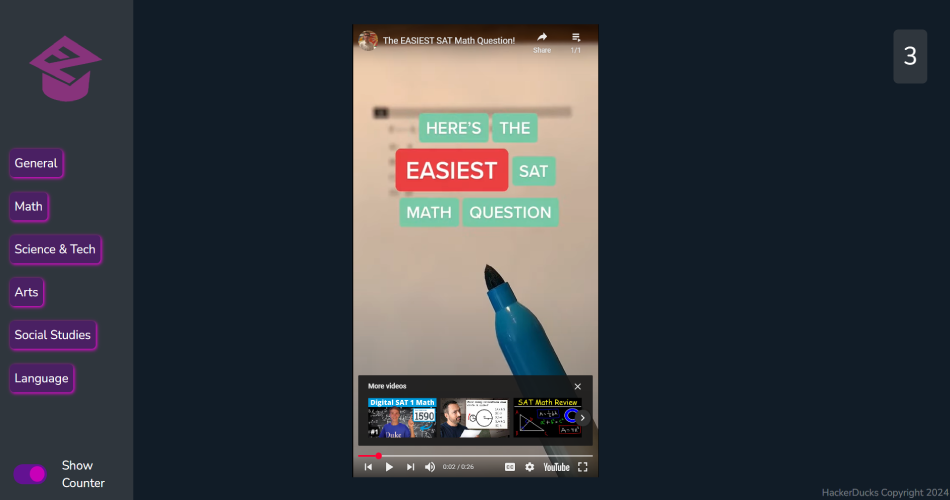

# EasyEd
A web-based application that filters results from YouTube Shorts for educational content, mainly used for avoiding the brainrot prevalent on the platform.

Winner of the Best Web App prize!

